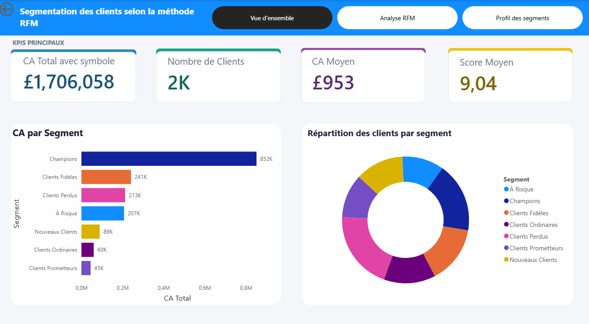
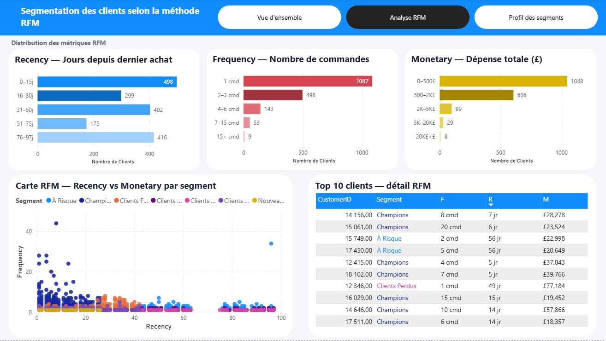
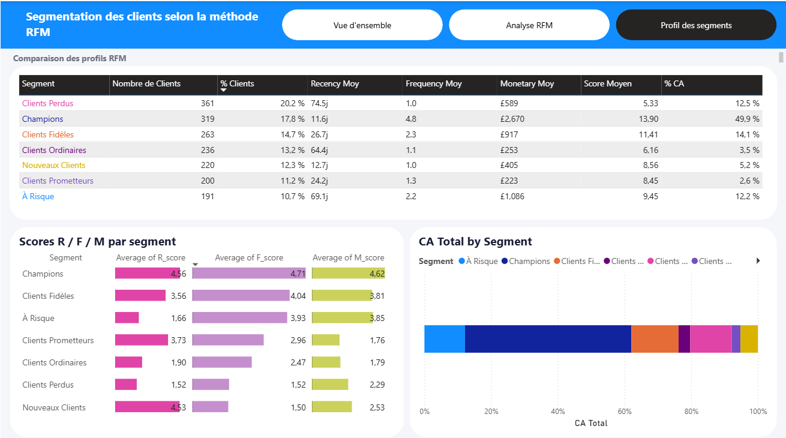

# 🛒 Customer Segmentation — Analyse RFM & Dashboard Power BI

> Projet Data Analyst complet : segmentation client par la méthode RFM (Recency, Frequency, Monetary) sur un dataset e-commerce retail, de l'analyse Python jusqu'au dashboard interactif Power BI.


---

## 📋 Table des matières

1. [À propos du projet](#-à-propos-du-projet)
2. [Dataset](#-dataset)
3. [Structure du projet](#-structure-du-projet)
4. [Méthodologie RFM](#-méthodologie-rfm)
5. [Pipeline du notebook](#️-pipeline-du-notebook)
6. [Résultats clés](#-résultats-clés)
7. [Dashboard Power BI](#-dashboard-power-bi)
8. [Installation et utilisation](#-installation-et-utilisation)
9. [Recommandations business](#-recommandations-business)
10. [Limites et améliorations futures](#️-limites-et-améliorations-futures)
11. [Stack technique](#️-stack-technique)
12. [Auteure](#-auteure)

---

## 🎯 À propos du projet

Ce projet illustre une **analyse complète de segmentation client** réalisée avec la méthode **RFM**, l'une des techniques les plus utilisées en marketing data analytics, appliquée à un dataset e-commerce réel.

L'objectif est de transformer des données transactionnelles brutes en **segments clients actionnables**, permettant à une entreprise e-commerce de :

- Identifier ses meilleurs clients (Champions) et les fidéliser
- Détecter les clients à risque avant qu'ils ne partent
- Personnaliser ses campagnes marketing par segment
- Estimer le potentiel de revenus additionnels

Le projet va **de bout en bout** : nettoyage des données brutes en Python, calcul des scores RFM, segmentation, visualisations exploratoires dans Jupyter, puis construction d'un **dashboard Power BI interactif à 3 pages** avec navigation personnalisée et charte graphique homogène.

**Compétences mobilisées :**
`Python` · `Pandas` · `NumPy` · `Matplotlib` · `Seaborn` · `Plotly` · `Power BI` · `DAX` · `Analyse exploratoire (EDA)` · `Nettoyage de données` · `Scoring RFM` · `Data Visualization` · `Storytelling data`

---

## 📦 Dataset

| Propriété | Valeur |
|---|---|
| Source | [Kaggle — Customer Segmentation](https://www.kaggle.com/code/fabiendaniel/customer-segmentation) |
| Période | Décembre 2010 — Mars 2011 (97 jours) |
| Lignes brutes | 112 803 |
| Colonnes | 8 |
| Pays représentés | 31 |
| Produits uniques | 3 108 |
| Commandes uniques | 5 310 |

### Colonnes du dataset

| Colonne | Type | Description | Rôle RFM |
|---|---|---|---|
| `InvoiceNo` | object | Numéro de facture | Frequency |
| `StockCode` | object | Code produit | — |
| `Description` | object | Nom du produit | — |
| `Quantity` | int64 | Quantité achetée | Monetary |
| `InvoiceDate` | object → datetime | Date de commande | Recency |
| `UnitPrice` | float64 | Prix unitaire (£) | Monetary |
| `CustomerID` | float64 | Identifiant client | Clé principale |
| `Country` | object | Pays du client | — |

---

## 📁 Structure du projet

```
customer-segmentation-rfm/
│
├── 📓 notebooks/
│   └── Customer_Segmentation.ipynb     ← Notebook principal (analyse complète)
│
├── 📊 data/
│   ├── data.csv                         ← Dataset brut (non inclus, voir Kaggle)
│   ├── rfm_final.csv                    ← Output RFM par client (1 790 lignes)
│   └── rfm_par_segment.csv             ← Moyennes RFM par segment
│
├── 📈 visuals/
│   ├── Vue_d_ensemble.png              ← Dashboard Power BI - Page 1
│   ├── Analyse_RFM.png                 ← Dashboard Power BI - Page 2
│   ├── Profils_des_segments.png        ← Dashboard Power BI - Page 3
│
├── 📋 powerbi/
│   └── dashboard_rfm.pbix              ← Dashboard Power BI (3 pages)
│
└── README.md
```

---

## 🔬 Méthodologie RFM

### Qu'est-ce que le RFM ?

Le modèle RFM est une technique de segmentation client basée sur trois métriques comportementales :

```
┌─────────────────────────────────────────────────────────┐
│  R — RECENCY    Depuis combien de jours le client       │
│                 a-t-il effectué son dernier achat ?     │
│                 → Petit R = client récent = BON          │
├─────────────────────────────────────────────────────────┤
│  F — FREQUENCY  Combien de commandes distinctes         │
│                 le client a-t-il passées ?              │
│                 → Grand F = client fidèle = BON          │
├─────────────────────────────────────────────────────────┤
│  M — MONETARY   Quel montant total le client            │
│                 a-t-il dépensé ?                        │
│                 → Grand M = client à forte valeur = BON  │
└─────────────────────────────────────────────────────────┘
```

### Règles de segmentation

| Segment | Condition | Profil |
|---|---|---|
| 🏆 Champions | R≥4, F≥4, M≥4 | Récents, fréquents, gros dépensiers |
| ⭐ Clients Fidèles | R≥3, F≥3, M≥3 | Réguliers et engagés |
| 🆕 Nouveaux Clients | R≥4, F≤2 | Récents mais peu d'achats |
| 📈 Clients Prometteurs | R≥3, F≥2 | Bon potentiel à développer |
| ⚠️ À Risque | R≤2, F≥3, M≥3 | Anciens bons clients qui s'éloignent |
| 💤 Clients Perdus | R≤2, F≤2 | Inactifs depuis longtemps |
| 🔄 Clients Ordinaires | Autres | Profil intermédiaire |

---

## ⚙️ Pipeline du notebook

```
Données brutes (112 803 lignes)
        ↓
   Nettoyage & EDA
   • Suppression CustomerID nuls (-33.6%)
   • Suppression quantités négatives (-1.8%)
   • Suppression doublons (-0.9%)
        ↓
   Dataset propre (71 899 lignes)
        ↓
   Calcul RFM par client
   • Recency  = (date_ref - dernière commande).days
   • Frequency = nombre de factures distinctes
   • Monetary  = somme des TotalPrice
        ↓
   1 790 profils clients
        ↓
   Scoring 1→5 par quintiles (pd.qcut)
   • R_score : inversé (5 = récent)
   • F_score : normal (5 = fréquent)
   • M_score : normal (5 = dépensier)
        ↓
   RFM_Score = R + F + M (entre 3 et 15)
        ↓
   Segmentation en 7 groupes
        ↓
   Visualisations + Insights + Recommandations
        ↓
   Export rfm_final.csv → Power BI
```

Chaque étape du notebook est accompagnée d'**insights détaillés** expliquant ce que les chiffres révèlent, et d'une **section recommandations finale** chiffrée par segment.

---

## 📊 Résultats clés

### Vue d'ensemble

| Métrique | Valeur |
|---|---|
| Clients analysés | **1 790** |
| Chiffre d'affaires total | **£1 706 058** |
| Revenu médian / client | **£392.60** |
| Clients avec 1 seule commande | **1 087 (60.7%)** |
| Clients avec score parfait (15/15) | **109 (6.1%)** |
| Top 20% clients → % revenus | **69% des revenus** |

### Répartition des segments

| Segment | Clients | % Clients | Revenue | % Revenue |
|---|---|---|---|---|
| 🏆 Champions | 319 | 17.8% | £851 782 | **49.9%** |
| ⭐ Clients Fidèles | 263 | 14.7% | £241 132 | 14.1% |
| 💤 Clients Perdus | 361 | 20.2% | £212 518 | 12.5% |
| ⚠️ À Risque | 191 | 10.7% | £207 333 | 12.2% |
| 🆕 Nouveaux Clients | 220 | 12.3% | £89 065 | 5.2% |
| 🔄 Clients Ordinaires | 236 | 13.2% | £59 648 | 3.5% |
| 📈 Clients Prometteurs | 200 | 11.2% | £44 579 | 2.6% |

### Découverte principale

> **319 Champions (17.8% des clients) génèrent £851 782, soit 49.9% du chiffre d'affaires total.**
> La loi de Pareto est confirmée et même amplifiée : le top 20% des clients génère 69% des revenus.
> À l'inverse, **60.7% des clients n'ont commandé qu'une seule fois**, révélant un enjeu majeur de rétention.

---

## 📋 Dashboard Power BI

Le dashboard interactif (`powerbi/dashboard_rfm.pbix`) contient **3 pages** avec une navigation personnalisée par boutons et une charte graphique homogène (fond clair, cartes blanches arrondies, couleurs cohérentes par segment).

### Page 1 — Vue d'ensemble



- 4 cartes KPI : CA Total, Nombre de clients, CA Moyen, Score Moyen
- Graphique en barres : CA par segment
- Graphique en anneau : répartition des clients par segment

### Page 2 — Analyse RFM



- 3 histogrammes : distributions Recency, Frequency, Monetary
- Carte RFM (scatter plot) : Recency vs Frequency, taille = Monetary, couleur = segment
- Table détaillée : Top 10 clients avec leurs scores R, F, M

### Page 3 — Profil des segments



- Tableau comparatif des 7 segments (Nb clients, % clients, moyennes RFM, % CA)
- Scores moyens R / F / M par segment (graphique en barres)
- Répartition du CA total par segment (barres empilées 100%)

**Source de données** : `rfm_final.csv` (1 790 lignes × 9 colonnes), enrichi de mesures DAX (CA Total, Nb Clients, CA Moyen, Part CA %, Score Moyen).

---

## 💻 Installation et utilisation

### Prérequis

```bash
Python 3.10+
Jupyter Notebook ou JupyterLab
Power BI Desktop (pour ouvrir le dashboard .pbix)
```

### Installation des dépendances

```bash
pip install pandas numpy matplotlib seaborn plotly scikit-learn jupyter
```

### Lancer le notebook

```bash
git clone https://github.com/[votre-username]/customer-segmentation-rfm.git
cd customer-segmentation-rfm
jupyter notebook notebooks/Customer_Segmentation.ipynb
```

### Données

Le fichier `data.csv` n'est pas inclus dans ce dépôt (taille importante).
Téléchargez-le directement sur [Kaggle](https://www.kaggle.com/code/fabiendaniel/customer-segmentation) et placez-le dans le dossier `data/`.

### Ouvrir le dashboard

Ouvrez `powerbi/dashboard_rfm.pbix` avec Power BI Desktop. Le fichier est connecté à `data/rfm_final.csv` — actualisez la source de données si vous déplacez le fichier (`Accueil → Actualiser`).

---

## 💼 Recommandations business

### Potentiel de revenus additionnels estimé : +£150 575 (+8.8% CA)

| Priorité | Segment | Action | Potentiel |
|---|---|---|---|
| 1 | 🏆 Champions | Programme VIP, parrainage, accès anticipé | Protection du CA (49.9%) |
| 2 | ⚠️ À Risque | Campagne de réactivation -15% (fenêtre 3 semaines) | +£51 833 |
| 3 | ⭐ Fidèles | Upsell, gamification statut VIP | +£48 226 |
| 4 | 🆕 Nouveaux | Onboarding 24h + offre 2ème achat | +£35 640 |
| 5 | 💤 Perdus | Win-back -25% (1 email, budget limité) | +£14 876 |

Le détail complet de chaque recommandation (actions concrètes, KPI à suivre, fenêtres d'action) est disponible dans la dernière section du notebook.

---

## 🛠️ Stack technique

| Outil | Usage |
|---|---|
| **Python (Pandas, NumPy)** | Nettoyage, calculs RFM, agrégations |
| **Matplotlib / Seaborn** | Visualisations statistiques (histogrammes, distributions) |
| **Plotly** | Carte RFM interactive (scatter plot) |
| **Jupyter Notebook** | Environnement d'analyse exploratoire |
| **Power BI Desktop** | Dashboard interactif, mesures DAX, navigation par signets |
| **Git / GitHub** | Versioning et partage du projet |

---

## 👩‍💻 Auteure
Doha TIRAOUI
(Projet réalisé dans le cadre d'un apprentissage autonome en Data Analytics, de l'analyse exploratoire en Python jusqu'au dashboard Power BI complet).

**Stack utilisée :** Python · Pandas · Plotly · Power BI · DAX · Git

---

*⭐ Si ce projet vous a été utile, n'hésitez pas à laisser une étoile sur le dépôt !*
